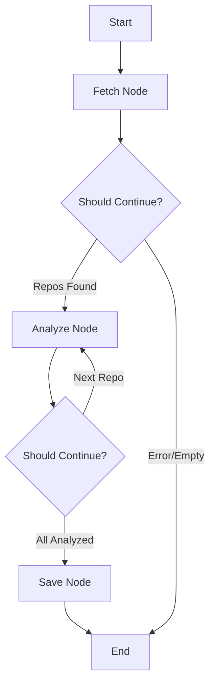

# 🤖 AI Portfolio Sync Agent: Detailed Flow Explanation

This document explains how the LangGraph-powered agent automates your portfolio updates.

## 🏗️ Architecture Overview

The agent uses **LangGraph**, a framework for building stateful, multi-agent applications. Unlike a simple script, this agent maintains a "state" as it moves through different stages of processing.

---

## 🚀 Step-by-Step Workflow

### 1. State Initialization
The process starts with an empty `AgentState`. This state keeps track of:
- `repos`: The list of raw repositories fetched from GitHub.
- `processed_data`: The curated information generated by the AI.
- `current_repo_index`: A pointer to which repo is currently being analyzed.

### 2. The "Fetch & Filter" Node
The agent calls the **GitHub API**:
- It retrieves all your public repositories.
- **Optimization**: It compares each repo's `updated_at` timestamp with the data already in your `projects.json`.
- **Cache Hit**: If a project hasn't changed since the last run, the agent **skips the AI analysis** and reuses the existing description.
- **Cache Miss**: Only new or recently updated projects are queued for AI analysis.

### 3. The "Analyze" Node (The Brain) 🧠
For the repos that *did* change:
1. **Context Gathering**: The agent fetches the `README.md` content.
2. **LLM Reasoning (Gemini 1.5 Flash)**: It sends a structured prompt to Gemini.
3. **Structured Output**: Gemini returns professional JSON.

### 4. The "Save" Node
The agent merges the **Cached Data** (unchanged) with the **New AI Data** (updated) and saves the complete list to `projects.json`.

---

## 🛠️ Key Technologies Used

- **LangGraph**: Orchestrates the flow and handles the loop through repositories.
- **Gemini 1.5 Flash**: Acts as the "Expert Developer" to curate your project descriptions.
- **GitHub API**: Provides real-time data about your activity.
- **GitHub Actions**: Runs this whole process in the cloud automatically.

---

## 💡 Why an Agent instead of a simple script?
A simple script might just copy your GitHub descriptions (which are often messy or missing). The **AI Agent** actually "understands" your project by reading the code/README and presents it professionally to potential recruiters or clients.
